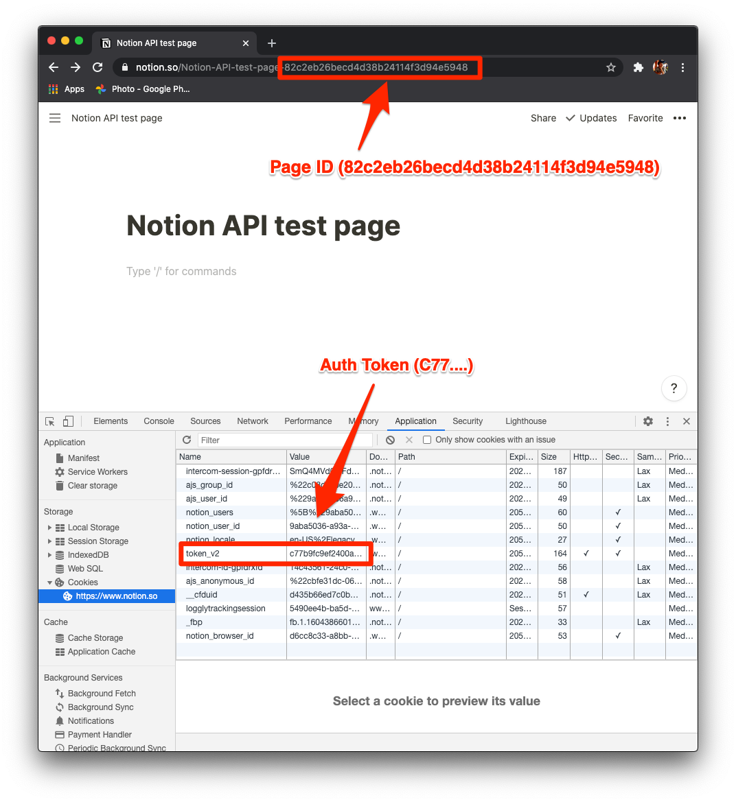
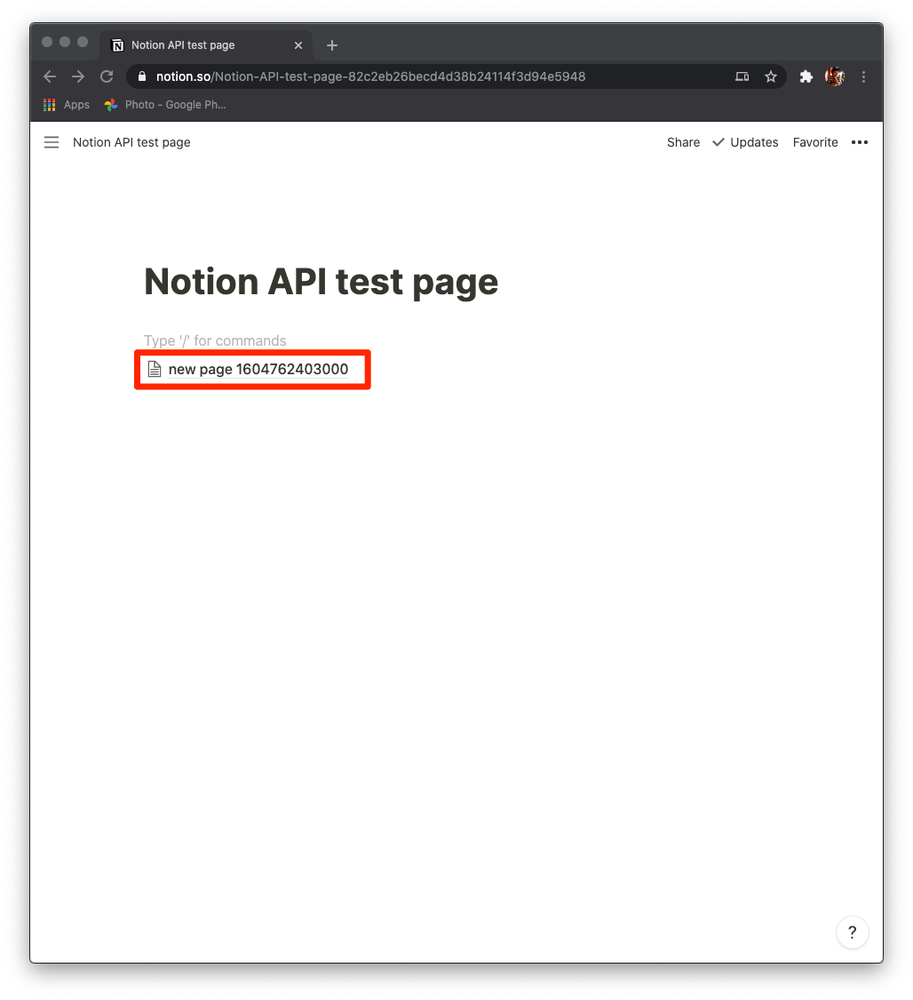
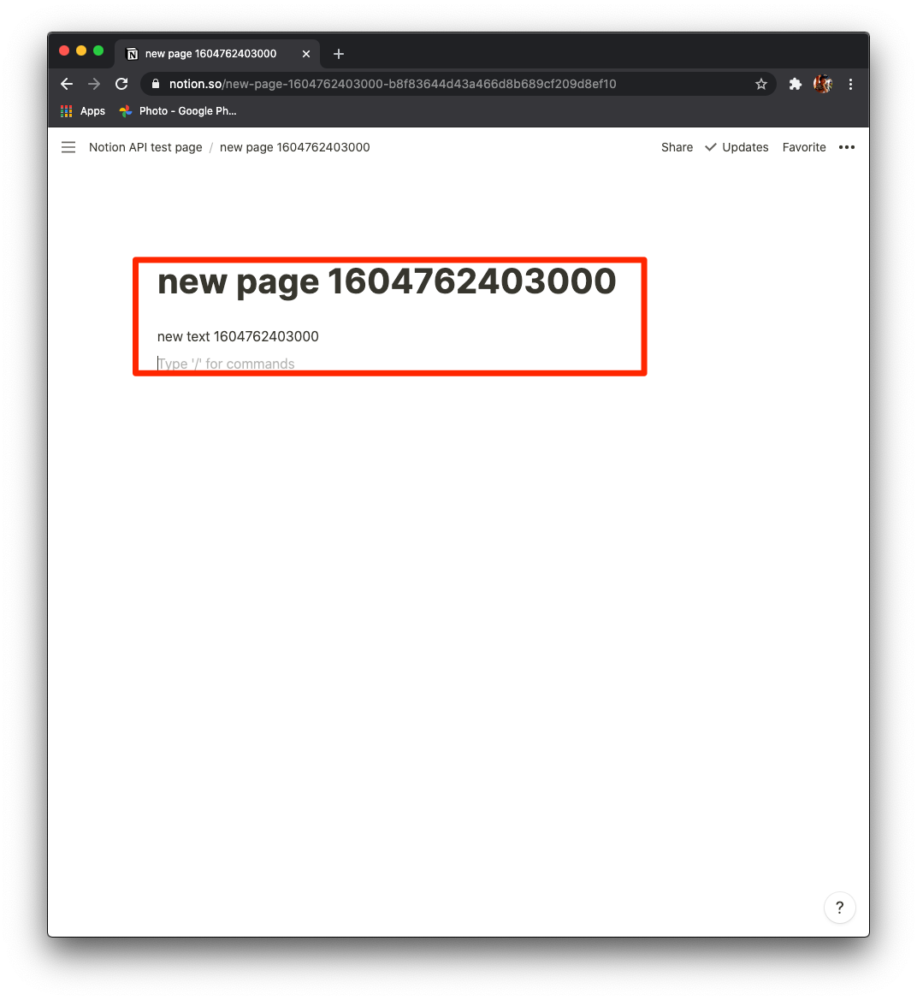

# Learn Notion API using go sdk

Use https://github.com/kjk/notionapi

1. Copy auth token and page id.
   
1. Set environment variables and run.
    ```bash
    $ export NOTION_AUTH_TOKEN="TOKEN"
    $ export NOTION_PAGE_ID="PAGE_ID"
    $ go run main.go
    ```
1. Check new page and contents.
    
    